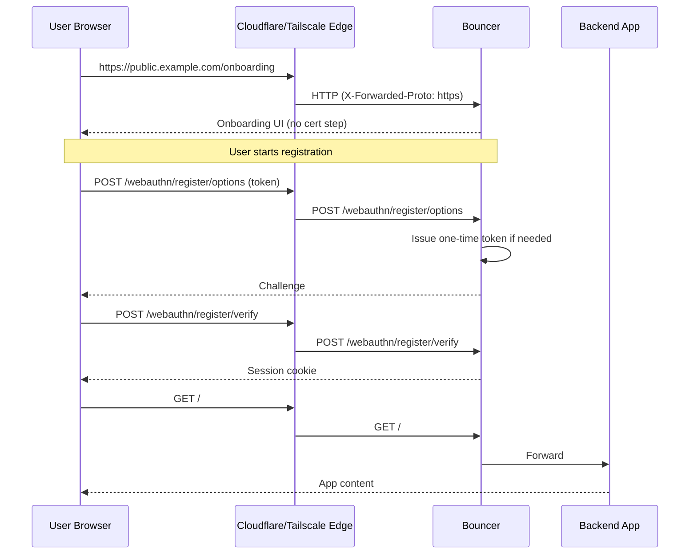
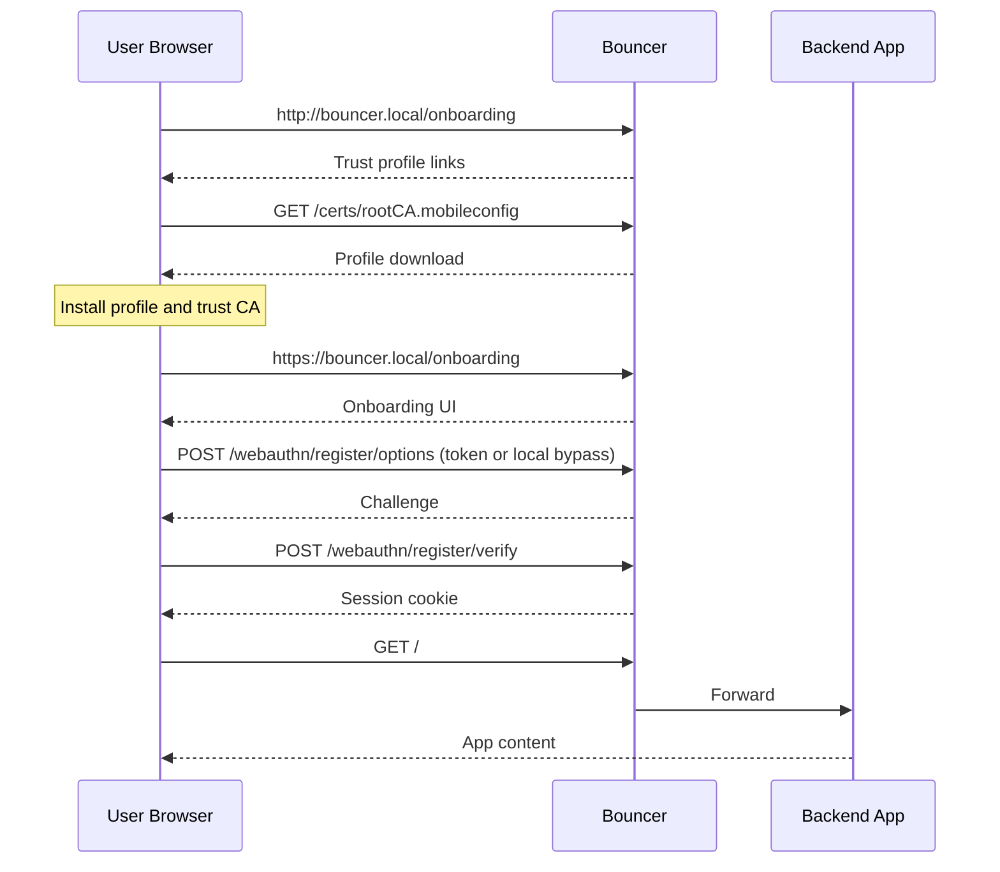

# Architecture

## Overview

Bouncer is structured as a standard Go project with internal packages, an embedded web UI, and a single `main.go` entry point.

```
bouncer/
├── main.go                 # Entry point: CLI, routing, server startup
├── go.mod / go.sum
├── Makefile
├── Dockerfile
├── SPEC.md                 # Full specification
├── internal/
│   ├── atomicfile/         # Atomic file writes (temp + fsync + rename)
│   ├── authn/              # WebAuthn registration + login handlers
│   ├── ca/                 # Built-in CA, server cert, mobileconfig generation
│   ├── config/             # Config types, JSON persistence, user CRUD
│   ├── localip/            # RFC1918/loopback detection, trusted proxy logic
│   ├── proxy/              # Reverse proxy with X-Forwarded-* headers
│   ├── session/            # File-backed session store with TTL + cleanup
│   ├── site/               # Host-based site registry (multi-site routing)
│   └── token/              # 6-digit enrollment token generation
└── web/
    ├── embed.go            # embed.FS for static files
    ├── login.html          # Passkey login page
    └── onboarding.html     # Onboarding page (trust + passkey creation)
```

## Package Dependency Graph

```
main.go
├── config          (load/save bouncer.json)
├── ca              (generate CA + server cert, mobileconfig)
│   └── config
├── session         (file-backed sessions)
│   └── atomicfile
├── site            (host-based site registry)
│   ├── config
│   └── localip
├── authn           (WebAuthn handlers)
│   ├── config
│   ├── session
│   ├── site
│   ├── localip
│   └── go-webauthn/webauthn (external)
├── proxy           (reverse proxy)
│   └── localip
├── token           (enrollment token)
├── localip         (IP detection)
└── web             (embedded HTML)
```

## Deployment Scenarios

### 1) Public HTTPS (Cloudflare Tunnel / Tailscale Funnel)

**When to use:** you have a public hostname and want zero local TLS setup.



**Interaction flow**
1. User hits `/onboarding` on the public HTTPS hostname.
2. Bouncer issues a one-time token on the first registration attempt (logs + Pushover).
3. User enters the token and completes WebAuthn registration.
4. Session cookie is set and the request is forwarded to the backend.

### 2) Local HTTPS (private domain + private CA)

**When to use:** you have a local hostname and want LAN-only access.



**Interaction flow**
1. User visits `/onboarding` over HTTP to fetch the trust profile.
2. After trusting the CA, the user returns via HTTPS and registers a passkey.
3. Bouncer validates the token (or local bypass) and issues a session.
4. Authenticated requests are forwarded to the backend.

## Data Flow

### Normal Mode (authenticated request)

```
Browser → HTTPS → Bouncer
  0. Resolve site by Host / X-Forwarded-Host (trusted proxies only)
  1. Check session cookie (must match resolved site)
  2. Valid? → forward to site backend via reverse proxy
  3. Invalid/missing? → redirect to /login
```

### Onboarding Mode (new user)

```
Browser → HTTP/HTTPS → Bouncer
  1. GET /onboarding → serve onboarding page
  2. User installs .mobileconfig (local TLS only)
  3. User enters one-time 6-digit token (issued on demand; skipped for local IPs)
  4. POST /webauthn/register/options → server returns challenge
  5. Browser creates credential (navigator.credentials.create)
  6. POST /webauthn/register/verify → server verifies + saves user
  7. Session cookie set → redirect to backend
```

### Login (returning user)

```
Browser → HTTPS → Bouncer
  1. GET /login → serve login page
  2. POST /webauthn/login/options → server returns challenge
  3. Browser asserts credential (navigator.credentials.get)
  4. POST /webauthn/login/verify → server verifies
  5. Session cookie set → redirect to backend
```

## Persistence

Two files:

| File | Contents | Writes |
|---|---|---|
| `bouncer.json` | Config, TLS CA/cert PEM, users + credentials | On user registration, sign count update |
| `sessions.json` | Active sessions (ID, user, timestamps) | On login, logout, periodic cleanup |

Both use atomic writes (temp file → fsync → rename) to prevent corruption.

## TLS Architecture

### Local TLS Mode

```
Bouncer
├── Generates root CA (ECDSA P-256, 10-year validity)
├── Generates server cert signed by CA (1-year, SANs from config)
├── Persists both in bouncer.json
├── Serves .mobileconfig + .cer over HTTP (port 80)
└── Serves everything else over HTTPS (port 443)
```

### Cloudflare Tunnel Mode

```
Cloudflare Edge
├── Terminates TLS
├── Forwards to Bouncer over HTTP
└── Sets X-Forwarded-Proto: https

Bouncer
├── Listens HTTP only
├── Trusts X-Forwarded-* only from trustedProxies CIDRs
└── Skips CA/cert generation entirely
```

## Security Boundaries

- **Session cookie**: httpOnly, Secure, SameSite=Lax. 7-day TTL (configurable).
- **WebAuthn challenges**: stored in-memory, expire after 5 minutes.
- **Enrollment token**: one-time 6-digit code issued on demand, logged (and optionally sent via Pushover), never exposed via API.
- **Trusted proxies**: X-Forwarded-* headers stripped unless RemoteAddr matches CIDR list.
- **File permissions**: bouncer.json and sessions.json written with mode 0600.

## External Dependencies

| Dependency | Purpose |
|---|---|
| `github.com/go-webauthn/webauthn` | WebAuthn server-side logic |
| `github.com/fxamacker/cbor/v2` | CBOR decoding (transitive via webauthn) |

All other functionality uses Go stdlib (`crypto/x509`, `crypto/ecdsa`, `net/http`, `encoding/json`, etc.).
